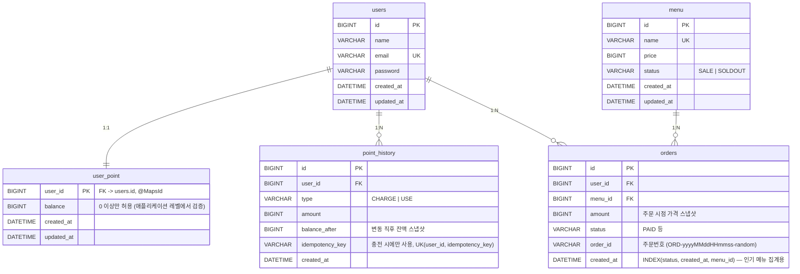

# ☕️ Cafe API


<br>


<br>


<br>


다수 서버 환경에서도 안정적으로 동작하는 것을 목표로 한 커피숍 주문 시스템입니다. 메뉴 조회, 포인트 충전, 주문/결제, 인기 메뉴 조회 4개 API를 제공합니다.

## 🔗 Link

- GitHub: https://github.com/prjkmo112/cafe-api
- API 명세서: [docs/API_SPEC.md](docs/API_SPEC.md)
- 기술 선택 및 구현 이유: [docs/TECHNICAL_DECISIONS.md](docs/TECHNICAL_DECISIONS.md)

## 🚀 실행 방법

```bash
# 1) MySQL / Redis / Kafka 를 로컬에 띄움
docker compose up -d

# 2) 애플리케이션 실행
./gradlew bootRun
```

- 앱이 뜨면 `src/main/resources/data.sql`이 자동 실행되어, 메뉴 5개와 사용자 3명(포인트 잔액 포함)이 시드 데이터로 들어갑니다.
- Swagger UI: http://localhost:8080/swagger-ui.html
- Kafka UI: http://localhost:8088 (`order-paid` 토픽 메시지 확인용)

## 🏗️ 설계 내용

### ERD



> - `orders.status`는 `PAID`, `PREPARING_DELIVERY`, `SHIPPING`, `DELIVERED`, `CANCELED`를 정의해뒀지만, 
> 현 프로젝트에서는 데모 목적이므로 다른 상태로 전이시키는 로직은 제외했습니다. 
> 해당 기능을 대비해 상태 전이 규칙(`Order.transitTo`)만 미리 마련해뒀습니다.
> 실제 결제 연동도 제외했습니다.
>
> - `user_point`는 `users`와 PK를 공유하는 1:1(`@MapsId`)이며, 충전과 결제 시 비관적 락(`FOR UPDATE`)을 거는 대상 행입니다. 잔액을 `users`에서 분리해 잔액 갱신 경합이 신원 정보 조회와 섞이지 않게 했습니다.
> - `orders.order_id`(주문번호)는 사람이 읽기 위한 식별자일 뿐, 멱등성 판단에는 쓰이지 않습니다.

### 📐 설계의 의도

"정답이 있는 과제가 아니라 왜 이렇게 설계했는지 설명하는 과제"라고 안내되어 있어서, 기능 구현보다 아래 4가지 관점의 질문에 코드와 구조로 답하는 것을 목표로 삼았습니다.

| 관점 | 핵심 질문 | 설계 원칙 | 적용 지점 |
|---|---|---|---|
| **확장성** | 서버가 여러 대여도 똑같이 동작하는가 | JVM 락, 로컬 캐시, 단일 스케줄러처럼 "서버 1대" 전제를 쓰지 않고, DB 락, DB 유니크 제약, 이벤트 기반 처리만 사용 | 잔액 락, 충전 멱등성, 커밋 후 발행(리더 선출 불필요) |
| **동시성** | 동시에 온 요청 중 하나만 반영돼야 하는 지점은 어디인가 | 꼭 필요한 곳만 정확히 잠그고, 읽기 위주 지점은 잠그지 않음 | 잠금: 포인트 충전/사용, 충전 멱등키<br>무잠금: 메뉴 조회, 인기 메뉴 조회 |
| **데이터 일관성** | 일부만 반영된 상태가 남지 않는가 | 관련 쓰기는 하나의 트랜잭션으로 묶고, DB를 항상 원본으로 둠 | 주문 트랜잭션(차감 + 주문 저장), 인기 메뉴는 `orders` 직접 집계 |
| **장애 격리** | 외부 시스템이 느려지거나 죽어도 서비스는 살아 있는가 | 핵심 경로(DB 트랜잭션)와 부가 경로(Kafka, Redis)를 분리 | 커밋 후 비동기 Kafka 발행, 캐시 오류는 로그만 남기고 DB로 fallback |

### 🧭 문제 해결 전략과 분석

기능별로 "무엇을 대안으로 검토했고 왜 그것을 골랐는지"를 아래처럼 정리했습니다.

| 문제 | 검토한 대안 | 선택 | 이유 |
|---|---|---|---|
| 포인트 충전 중복 요청 방지 | 1) 포트원(PortOne) 등 PG 연동으로 결제 단위의 고유 ID에 위임<br><ins>**2) 서버 멱등키(`idempotencyKey`) + DB 유니크**</ins> | 2) | 1)은 이 과제에서 결제 연동을 제외했고, PG를 붙여도 서버 측 중복 반영 방지는 여전히 필요함. 포트원처럼 요청 단위 고유 키를 클라이언트가 보내는 방식을 참고했고, 재시도, 더블클릭, 다중 인스턴스 동시 도달은 클라이언트가 막을 수 없어 `(user_id, idempotency_key)` 선조회 + DB 유니크 제약을 2단계 방어로 둠 |
| 포인트 잔액 동시 갱신 | 1) 낙관적 락(버전 컬럼)<br><ins>**2) 비관적 락(`SELECT FOR UPDATE`)**</ins> | 2) | 잔액은 충돌 시 재시도 없이 항상 정확해야 하고, 같은 사용자 행에 갱신이 몰릴 수 있어 즉시 직렬화되는 비관적 락을 택함 |
| 주문 내역 실시간 전송 | 1) 결제 트랜잭션 안에서 동기 Kafka 발행<br>2) Outbox 테이블 + 폴링 발행<br><ins>**3) 커밋 후(`AFTER_COMMIT`) 비동기 발행**</ins> | 3) | 1)은 Kafka 장애가 결제 실패로 번지는 dual-write 문제가 있음. 2)는 안전하지만, 전송 대상이 결제의 source of truth가 아닌 분석용 데이터 수집 플랫폼이라 과한 비용이라고 판단. 커밋과 발행 사이 극히 짧은 구간의 유실 가능성을 감수하는 대신 구조를 단순하게 유지함 |
| 인기 메뉴 집계 | 1) Kafka로 실시간 집계해 Redis ZSet에 카운트<br><ins>**2) `orders` 테이블 직접 집계 + Redis는 결과 캐시**</ins> | 2) | "메뉴별 주문 횟수가 정확해야 한다"는 요구가 명시되어 있어, 유실 가능성이 있는 이벤트 스트림을 원본으로 쓰면 안 된다고 판단. DB가 항상 정답이고, Redis는 캐싱으로만 사용 |

### 🔧 기술적 선택 이유

| 기술 | 사용처 | 선택 이유 |
|---|----|-----|
| MySQL (비관적 락) | 포인트 충전/차감 | 여러 인스턴스에서도 동일하게 동작하는 락이 필요했고, JVM 락은 서버가 여러 대면 무력화되기 때문 |
| DB 유니크 제약 | 충전 멱등성 방어 | 애플리케이션 코드의 사전 체크는 조회~삽입 사이 틈이 있어 동시 요청 2개가 모두 통과할 수 있음. DB 제약이 최종 방어선 |
| QueryDSL | 메뉴 목록 조회 | 선택 조건 6개를 임의로 조합하는 동적 쿼리라, 문자열 조립이나 메서드 이름 쿼리로는 감당이 안 됨 |
| Kafka | 주문 내역 실시간 전송 | 데이터 수집 플랫폼 연동을 브로커 기반으로 흉내내기 위함. 로컬 재현성을 위해 단일 브로커(KRaft)로 구성했고, 운영이라면 브로커 3대, 복제 계수 3, `min.insync.replicas=2`를 전제로 함 |
| `ApplicationEventPublisher` + `@TransactionalEventListener(AFTER_COMMIT)` | Kafka 발행, 인기 메뉴 캐시 무효화 | 트랜잭션 커밋 여부와 Kafka/Redis 호출을 분리하는 Spring 표준 패턴. 커밋된 경우에만 실행되고, `@Async`로 요청 스레드와도 분리함 |
| Redis (Spring Cache) | 인기 메뉴 캐시 | 매 요청마다 `GROUP BY` 집계 쿼리를 다시 태우지 않기 위한 짧은 TTL 캐시. 원본은 항상 DB |
| springdoc-openapi | 전체 API | Swagger UI로 별도 클라이언트 없이 API를 확인, 호출하기 위함 |
| Docker Compose | MySQL/Redis/Kafka | `docker compose up` 한 번으로 동일한 환경을 재현하기 위함 |

### 도전 요구사항에 대한 대응

| 요구사항 | 대응 |
|---|---|
| **다수 서버, 인스턴스** | 잔액 갱신은 DB 비관적 락, 충전 멱등성은 DB 유니크 제약으로 처리해 인스턴스 수와 무관하게 동일하게 동작합니다. Kafka 발행, 캐시 무효화도 각 요청이 자신의 트랜잭션 커밋 후 스스로 처리하는 구조라, 별도 리더 선출이나 인스턴스 간 조율이 필요 없습니다. |
| **동시성** | 실제로 두 가지를 동시 요청으로 재현해 검증했습니다. 1) 잔액이 정확히 1건분일 때 같은 메뉴를 동시에 2번 주문 → 1건만 성공, 잔액 0(음수 아님). 2) 같은 idempotencyKey로 포인트 충전 2건 동시 요청 → 1건만 성공(409), `point_history`엔 정확히 1건만 기록. |
| **데이터 일관성** | 메뉴 조회 → 재고 확인 → 포인트 차감 → 주문 저장이 하나의 트랜잭션(`OrderFacade.createOrder`)입니다. 실패 시 전부 롤백되어 "포인트만 깎이고 주문은 없는" 상태가 생기지 않습니다. |
| **테스트** | http, Junit 두 방법으로 테스트 코드 작성 완료했습니다. |

