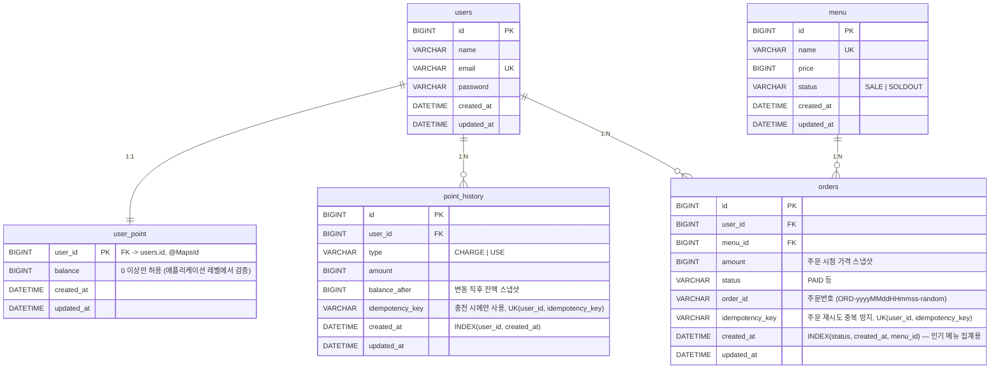

# ☕️ Cafe API


<br>


<br>


<br>


다수 서버 환경에서도 안정적으로 동작하는 것을 목표로 한 커피숍 주문 시스템입니다. 메뉴 조회, 포인트 충전, 주문/결제, 인기 메뉴 조회 4개 API를 제공합니다. (테스트용 사용자 등록 API가 추가로 있습니다.)

## 🔗 Link

- GitHub: https://github.com/prjkmo112/cafe-api
- TIL: https://velog.io/@codermo/%EA%B3%BC%EC%A0%9C-%EB%8D%B0%EC%9D%B4%ED%84%B0-%EC%A0%95%ED%95%A9%EC%84%B1%EA%B3%BC-%EC%8B%A4%EC%8B%9C%EA%B0%84-%EC%B2%98%EB%A6%AC-K%EC%82%AC-%EC%84%9C%EB%B2%84-%EA%B0%9C%EB%B0%9C-%EA%B3%BC%EC%A0%9C-%EC%B9%B4%ED%8E%98-%EC%A3%BC%EB%AC%B8-API
- API 명세서: [docs/API_SPEC.md](docs/API_SPEC.md)
- 기술 선택 및 구현 이유: [docs/TECHNICAL_DECISIONS.md](docs/TECHNICAL_DECISIONS.md)

## 🚀 실행 방법

```bash
# 1) MySQL / Redis / Kafka 를 로컬에 띄움
docker compose up -d

# 2) 애플리케이션 실행
./gradlew bootRun
```

- 앱이 뜨면 `src/main/resources/data.sql`이 자동 실행되어, 메뉴 5개와 사용자 3명(포인트 잔액 포함)이 시드 데이터로 들어갑니다.
- Swagger UI: http://localhost:8080/swagger-ui.html
- Kafka UI: http://localhost:8088 (`order-paid` 토픽 메시지 확인용)

## 🏗️ 설계 내용

### ERD



> - `orders.status`는 `PAID`, `PREPARING_DELIVERY`, `SHIPPING`, `DELIVERED`, `CANCELED`를 정의해뒀지만, 
> 현 프로젝트에서는 데모 목적이므로 다른 상태로 전이시키는 로직은 제외했습니다. 
> 해당 기능을 대비해 상태 전이 규칙(`Order.transitTo`)만 미리 마련해뒀습니다.
> 실제 결제 연동도 제외했습니다.
>
> - `user_point`는 `users`와 PK를 공유하는 1:1(`@MapsId`)이며, 충전과 결제 시 비관적 락(`FOR UPDATE`)을 거는 대상 행입니다. 잔액을 `users`에서 분리해 잔액 갱신 경합이 신원 정보 조회와 섞이지 않게 했습니다.
> - `orders.order_id`(주문번호)는 사람이 읽기 위한 식별자일 뿐, 멱등성 판단에는 쓰이지 않습니다.
> - `orders.idempotency_key`는 주문 재시도 중복 방지용이며 `(user_id, idempotency_key)` 유니크입니다. 기존 데이터 호환을 위해 nullable입니다.

### 📐 설계의 의도

"정답이 있는 과제가 아니라 왜 이렇게 설계했는지 설명하는 과제"라고 안내되어 있어서, 기능 구현보다 아래 4가지 관점의 질문에 코드와 구조로 답하는 것을 목표로 삼았습니다.

| 관점 | 핵심 질문 | 설계 원칙 | 적용 지점 |
|---|---|---|---|
| **확장성** | 서버가 여러 대여도 똑같이 동작하는가 | JVM 락, 로컬 캐시, 단일 스케줄러처럼 "서버 1대" 전제를 쓰지 않고, DB 락, DB 유니크 제약, 이벤트 기반 처리만 사용 | 잔액 락, 충전 멱등성, 커밋 후 발행(리더 선출 불필요) |
| **동시성** | 동시에 온 요청 중 하나만 반영돼야 하는 지점은 어디인가 | 꼭 필요한 곳만 정확히 잠그고, 읽기 위주 지점은 잠그지 않음 | 잠금: 포인트 충전/사용, 충전, 주문 멱등키<br>무잠금: 메뉴 조회, 인기 메뉴 조회 |
| **데이터 일관성** | 일부만 반영된 상태가 남지 않는가 | 관련 쓰기는 하나의 트랜잭션으로 묶고, DB를 항상 원본으로 둠 | 주문 트랜잭션(차감 + 주문 저장), 인기 메뉴는 `orders` 직접 집계 |
| **장애 격리** | 외부 시스템이 느려지거나 죽어도 서비스는 살아 있는가 | 핵심 경로(DB 트랜잭션)와 부가 경로(Kafka, Redis)를 분리 | 커밋 후 비동기 Kafka 발행, 캐시 오류는 로그만 남기고 DB로 fallback |

---

### 🧭 문제 해결 전략과 분석

#### 1. 포인트 충전 중복 요청 방지

* 문제 인식
  * 재시도, 더블클릭, 다중 인스턴스 동시 도달로 같은 충전 요청이 여러 번 반영될 수 있다.
* 검토한 대안
  * 포트원(PortOne) 등 PG 연동으로 결제 단위의 고유 ID에 위임
  * <ins>**서버 멱등키(`idempotencyKey`) + DB 유니크**</ins>
* 이유
  * PG 연동은 이 과제에서 결제 연동을 제외했다. PG를 붙여도 서버 측 중복 반영 방지는 여전히 필요하다.
  * 포트원처럼 요청 단위 고유 키를 클라이언트가 보내는 방식을 참고했다.
  * 재시도, 더블클릭, 다중 인스턴스 동시 도달은 클라이언트가 막을 수 없다. 그래서 `(user_id, idempotency_key)` 선조회와 DB 유니크 제약을 2단계 방어로 두었다.

#### 2. 주문 재시도 중복 방지

* 문제 인식
  * 응답이 유실되면 클라이언트가 재시도하기 쉽고, 이때 같은 주문이 중복 생성될 수 있다.
* 검토한 대안
  * 클라이언트 중복 클릭 방지에 의존
  * <ins>**서버 멱등키 + DB 유니크(충전과 동일)**</ins>
* 이유
  * 재시도와 다중 인스턴스 동시 도달은 클라이언트가 막을 수 없다.
  * 응답 유실 후 재시도가 흔하므로, 처음 결과를 그대로 반환하도록 했다.

#### 3. 포인트 잔액 동시 갱신

* 문제 인식
  * 같은 사용자의 잔액에 충전과 결제가 동시에 몰리면 갱신이 유실되거나 잔액이 틀어질 수 있다.
* 검토한 대안
  * 낙관적 락(버전 컬럼)
  * <ins>**비관적 락(`SELECT FOR UPDATE`)**</ins>
* 이유
  * 잔액은 충돌 시 재시도 없이 항상 정확해야 한다.
  * 같은 사용자 행에 갱신이 몰릴 수 있어, 즉시 직렬화되는 비관적 락을 택했다.

#### 4. 주문 내역 실시간 전송

* 문제 인식
  * 결제된 주문 내역을 데이터 수집 플랫폼으로 실시간 전송해야 하는데, 결제 트랜잭션과 외부 전송의 정합성을 어떻게 맞출지가 문제다.
* 검토한 대안
  * 결제 트랜잭션 안에서 동기 Kafka 발행
  * Outbox 테이블 + 폴링 발행
  * <ins>**커밋 후(`AFTER_COMMIT`) 비동기 발행**</ins>
* 이유
  * 동기 발행은 Kafka 장애가 결제 실패로 번지는 dual-write 문제가 있다.
  * Outbox는 안전하지만, 전송 대상이 결제의 source of truth가 아닌 분석용 데이터 수집 플랫폼이라 과한 비용이라고 판단했다.
  * 이벤트는 커밋 이후에만 나가므로 원본 주문은 항상 `orders`에 남고, 이벤트 내용도 모두 그 행에서 다시 만들 수 있다. 전달이 누락돼도 원본에서 재발행해 되살릴 수 있는 사본이라고 판단해, 구조를 단순하게 유지했다.

#### 5. 인기 메뉴 집계

* 문제 인식
  * "메뉴별 주문 횟수가 정확해야 한다"는 요구가 명시되어 있다.
* 검토한 대안
  * Kafka로 실시간 집계해 Redis ZSet에 카운트
  * <ins>**`orders` 테이블 직접 집계 + Redis는 결과 캐시**</ins>
* 이유
  * 이벤트 스트림은 원본의 사본이라 누락 시 카운트가 어긋난다. 정확성 요구를 지키려면 사본이 아니라 원본을 집계해야 한다.
  * DB가 항상 정답이고, Redis는 캐싱으로만 사용한다.

---

### 🔧 기술적 선택 이유

#### 1. MySQL (비관적 락)

* 사용처
  * 포인트 충전/차감
* 선택 이유
  * 여러 인스턴스에서도 동일하게 동작하는 락이 필요했다.
  * JVM 락은 서버가 여러 대면 무력화된다.

#### 2. DB 유니크 제약

* 사용처
  * 충전, 주문 멱등성 방어
* 선택 이유
  * 애플리케이션 코드의 사전 체크는 조회~삽입 사이에 틈이 있어, 동시 요청 2개가 모두 통과할 수 있다.
  * DB 제약이 최종 방어선이다.

#### 3. QueryDSL

* 사용처
  * 메뉴 목록 조회
* 선택 이유
  * 선택 조건 6개를 임의로 조합하는 동적 쿼리라, 문자열 조립이나 메서드 이름 쿼리로는 감당이 안 된다.

#### 4. Kafka

* 사용처
  * 주문 내역 실시간 전송
* 선택 이유
  * 데이터 수집 플랫폼 연동을 브로커 기반으로 흉내내기 위해 사용했다.
  * 로컬 재현성을 위해 단일 브로커(KRaft)로 구성했다.
  * 운영이라면 브로커 3대, 복제 계수 3, `min.insync.replicas=2`를 전제로 한다.

#### 5. `ApplicationEventPublisher` + `@TransactionalEventListener(AFTER_COMMIT)`

* 사용처
  * Kafka 발행, 인기 메뉴 캐시 무효화
* 선택 이유
  * 트랜잭션 커밋 여부와 Kafka/Redis 호출을 분리하는 Spring 표준 패턴이다. 커밋된 경우에만 실행된다.
  * Kafka 발행은 전용 스레드 풀(`@Async`)로 요청 스레드와 분리했다.
  * 인기 메뉴 캐시 무효화는 가벼운 Redis 삭제라 동기로 처리해, 주문 응답 전에 최신화한다(Redis 타임아웃 2초).

#### 6. Redis (Spring Cache)

* 사용처
  * 인기 메뉴 캐시
* 선택 이유
  * 매 요청마다 `GROUP BY` 집계 쿼리를 다시 태우지 않기 위한 짧은 TTL 캐시다.
  * 원본은 항상 DB다.
  * 캐시는 최대 5분 stale을 허용한다. 7일 창 이탈 시점과 조회-커밋 경쟁 시의 오차 상한이 TTL로 제한되며, 정확성의 원본은 항상 DB다.

#### 7. springdoc-openapi

* 사용처
  * 전체 API
* 선택 이유
  * Swagger UI로 별도 클라이언트 없이 API를 확인하고 호출하기 위해서다.

#### 8. Docker Compose

* 사용처
  * MySQL/Redis/Kafka
* 선택 이유
  * `docker compose up` 한 번으로 동일한 환경을 재현하기 위해서다.

---

### 도전 요구사항에 대한 대응

#### 1. 다수 서버, 인스턴스

* 잔액 갱신은 DB 비관적 락, 충전 멱등성은 DB 유니크 제약으로 처리해 인스턴스 수와 무관하게 동일하게 동작합니다.
* Kafka 발행과 캐시 무효화도 각 요청이 자신의 트랜잭션 커밋 후 스스로 처리하는 구조입니다. 그래서 별도 리더 선출이나 인스턴스 간 조율이 필요 없습니다.

#### 2. 동시성

* 실제 MySQL(Testcontainers)에 동시 요청을 보내는 통합 테스트(`ConcurrencyIntegrationTest`)로 세 가지를 검증했습니다. (아래 "4. 테스트" 참고)
  * 잔액이 정확히 1건분일 때 같은 메뉴를 서로 다른 멱등키로 동시에 10번 주문 → 1건만 성공, 잔액 0(음수 아님)
  * 같은 idempotencyKey로 포인트 충전 10건 동시 요청 → 1건만 반영, `point_history`엔 정확히 1건만 기록
  * 서로 다른 idempotencyKey로 포인트 충전 20건 동시 요청 → 모두 반영, 잔액 합계 정확(lost update 없음)
* 주문에도 멱등키를 적용했고(단위 테스트로 검증), 락 대기는 3초로 제한했습니다.

#### 3. 데이터 일관성

* 메뉴 조회 → 재고 확인 → 포인트 차감 → 주문 저장이 하나의 트랜잭션(`OrderFacade.createOrder`)입니다.
* 실패 시 전부 롤백되어 "포인트만 깎이고 주문은 없는" 상태가 생기지 않습니다.

#### 4. 테스트

* http 시나리오(`src/test/http/cafe-api.http`)와 JUnit 단위 테스트(Mockito)로 작성했습니다.
* 동시성은 `ConcurrencyIntegrationTest`로 Testcontainers 기반 MySQL 통합 테스트를 별도로 수행했습니다.

**Testcontainers 기반 MySQL 동시성 테스트**

```java
@Container
@ServiceConnection
static MySQLContainer mysql = new MySQLContainer("mysql:8.4");
```

테스트를 실행하면 Docker에 임시 MySQL 컨테이너가 생성되고, `@ServiceConnection`으로 Spring Boot `DataSource`에 자동 연결됩니다. (Kafka 발행은 이 테스트의 관심사가 아니라서 `KafkaTemplate`을 Mock으로 막아뒀습니다.)

`ExecutorService`와 `CountDownLatch`로 모든 스레드를 대기시켰다가 동시에 출발시켜 아래를 검증합니다.

| 시나리오 | 요청 | 기대 결과 |
|---|---|---|
| 동시 주문 | 잔액 4,000P(1잔분)에 서로 다른 멱등키로 10건 | 1건만 성공, 나머지는 `INSUFFICIENT_POINT`, 잔액 0 |
| 충전 멱등성 | 같은 멱등키로 10건 | 1건만 반영, `point_history` 1건 |
| Lost Update 방지 | 서로 다른 키로 20건(각 1,000P) | 20건 모두 성공, 잔액 20,000P |

이를 통해 실제 MySQL의 비관적 락과 UNIQUE 제약이 동시 요청에서도 정합성을 지키는지 확인합니다. 비관적 락을 제거하면 이 테스트가 실패함도 확인했습니다.

> 테스트 실행을 위해 Docker가 실행 중이어야 합니다.

