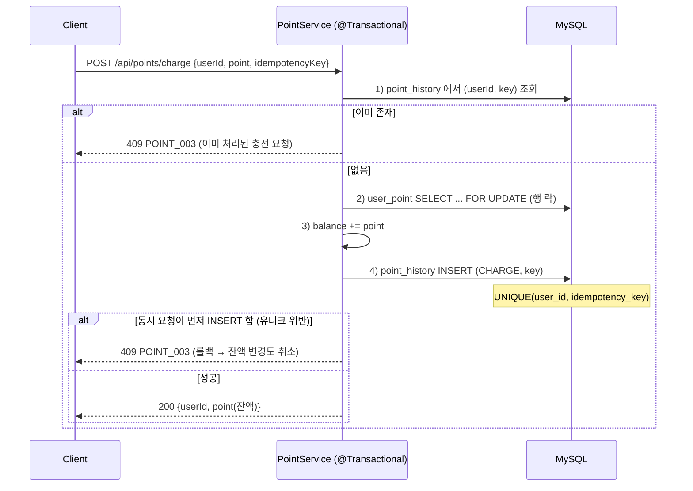

# 기술 선택 및 구현 이유

## 1. 회원가입 시 `users` + `user_point` 를 함께 생성

`UserService.register()` 가 하나의 트랜잭션에서 `users` 와 `user_point`(balance = 0)를 함께 저장합니다.

| 대안 | 판단 |
|---|---|
| 충전할 때 없으면 생성 (get-or-create) | 락 대상 행이 없어 `FOR UPDATE` 가 gap lock 으로 동작(데드락 위험), 최초 충전 2건이 동시에 INSERT 하는 경쟁 발생, 충전/결제마다 분기 증가 |
| <ins>**✅ 가입 시점에 함께 생성**</ins> | "충전 시점에 행이 반드시 존재한다"는 불변식이 생겨 충전 로직이 단순해짐 |

- 행이 없으면 곧 "존재하지 않는 회원"이라는 명확한 의미를 갖습니다.
- 두 INSERT 가 한 트랜잭션이라 `users` 만 있고 `user_point` 가 없는 상태는 생기지 않습니다.
- **트레이드오프**: `users` 를 `register` 외의 경로로 만들 때는 `user_point` 도 함께 넣어야 합니다. (`data.sql` 시드도 이 규칙을 따름)

---

## 2. `/api/menus` — QueryDSL

선택 조건 6개(`keyword`, `priceStart`, `priceEnd`, `status`, `createdAtStart`, `createdAtEnd`)를 임의로 조합하고, 페이징과 전체 개수까지 필요한 **동적 쿼리**입니다.

| 대안 | 판단 |
|---|---|
| Spring Data 메서드 이름 쿼리 | 조합마다 메서드가 필요(2⁶ 가지). 사실상 불가능 |
| `@Query` + `(:x is null or ...)` | 쿼리가 길고, `null` 처리 패턴이 인덱스 사용에 불리할 수 있음 |
| JPQL 문자열 조립 | 오타와 타입 오류를 런타임에서야 발견, `AND`/공백 버그 위험 |
| JPA Criteria / Specification | 타입 안전하지만 장황하고 가독성이 낮음 |
| <ins>**✅ QueryDSL**</ins> | 아래 참고 |

- **조건이 없으면 생략**: 각 조건을 `BooleanExpression` 으로 분리하고 값이 없으면 `null` 을 반환합니다. `BooleanBuilder.and(null)` 은 무시되므로 `if` 분기가 필요 없습니다.
- **컴파일 타임 검증**: `QMenu.menu.price` 처럼 Q-class 를 쓰므로 필드명 오타와 타입 불일치가 컴파일에서 잡힙니다.
- **조회와 count 가 같은 조건 공유**: 같은 `builder` 를 두 쿼리에 쓰므로 조건이 어긋날 수 없습니다.
- **범위 판단**: 조건이 고정된 인기 메뉴 집계(7일, 3개)는 QueryDSL 없이 JPQL `@Query` 로 처리했습니다. 동적 조합이 없는 곳까지 통일하지 않았습니다.

---

## 3. `/api/points/charge` — 멱등키와 비관적 락

충전은 `balance += amount` 라서 같은 요청이 두 번 처리되면 두 번 충전됩니다. 타임아웃 재시도, 더블클릭, LB 자동 재시도, 다중 인스턴스 동시 도달은 클라이언트가 막을 수 없습니다.

### 3.1 중복 요청 방지

| 대안 | 판단 |
|---|---|
| PG(포트원 등) 연동에 위임 | 이 과제는 결제 연동 제외. 붙여도 서버 측 중복 반영 방지는 여전히 필요 |
| <ins>**✅ 서버 멱등키 + DB 유니크**</ins> | 포트원처럼 요청 단위 고유 키를 클라이언트가 보내는 방식을 참고 |



방어를 2단계로 둔 이유는 다음과 같습니다.

| 단계 | 역할 |
|---|---|
| **1) 선조회** `findByUserIdAndIdempotencyKey` | 순차 재시도를 락을 잡기 전에 빠르게 걸러냄 |
| **2) 유니크 제약** `(user_id, idempotency_key)` | 선조회와 INSERT 사이의 틈에서 동시 요청 2개가 모두 통과해도 **DB 가 최종 방어선**이 되어 하나만 성공시킴 |

- JVM 락이나 로컬 캐시가 아니라 **DB 제약**에 의존하므로 서버가 몇 대로 늘어나도 동일하게 동작합니다.
- 키를 전역이 아니라 **사용자 단위**로 묶어, 다른 사용자가 같은 키를 써도 서로 막지 않습니다.

### 3.2 잔액 동시 갱신

멱등키는 "같은 요청"의 중복을, 락은 "서로 다른 요청"의 동시 갱신(다른 키로 동시에 충전, 충전과 결제가 동시에 발생)을 막습니다.

| 대안 | 판단 |
|---|---|
| 낙관적 락 (version) | 충돌 시 재시도 로직이 필요하고, 한 사용자 행에 갱신이 몰리면 재시도가 폭증 |
| <ins>**✅ 비관적 락 (`FOR UPDATE`)**</ins> | 즉시 직렬화되어 재시도 없이 항상 정확. 결제 시 잔액 부족 판단도 같은 락 안에서 이뤄짐 |

- 락 범위는 `user_point` **행 하나**입니다. 다른 사용자끼리는 서로 막지 않으므로, 인스턴스가 늘어도 같은 사용자의 갱신만 직렬화됩니다.

---

## 4. `/api/orders` — 차감과 저장을 한 트랜잭션으로

`OrderFacade.createOrder()` 가 트랜잭션 경계입니다.

```java
@Transactional
public OrderDto createOrder(CreateOrderRequestDto dto) {
    Menu menu = menuService.getMenu(dto.menuId());
    if (menu.getStatus() == MenuStatus.SOLDOUT) throw new BusinessException(ErrorCode.INSUFFICIENT_STOCK);
    pointService.use(dto.userId(), menu.getPrice());   // 락 + 차감 + point_history(USE)
    return orderService.createOrder(dto, menu);          // orders 저장 + 이벤트 발행
}
```

- 메뉴 확인 → 포인트 차감 → 주문 저장이 전부 성공하거나 전부 롤백됩니다. "포인트만 깎이고 주문이 없는" 상태는 불가능합니다.
- `PointService.use()` 와 `OrderService.createOrder()` 는 `Propagation.MANDATORY` 입니다. 트랜잭션 밖에서 단독 호출하면 예외가 나므로, **"차감이 주문 트랜잭션 밖에서 실행되는 실수"를 코드 레벨에서 막습니다.**
- **남은 과제**: 트랜잭션은 원자적이지만 `POST /api/orders` 가 재시도되면 중복 주문과 중복 차감이 생깁니다. 충전에 있는 멱등키가 주문에는 없습니다.

---

## 5. 인기 메뉴 — DB 원본, Redis 사본

요구사항은 최근 7일, 상위 3개, **주문 횟수가 정확해야 함**입니다.

| 대안 | 판단 |
|---|---|
| Kafka 소비 → Redis ZSet 카운트 | 유실을 감수하기로 한 채널이라 "정확" 요구와 충돌. 이벤트 1건 유실이 곧 영구 오차 |
| <ins>**✅ `orders` 직접 집계 + Redis 캐시**</ins> | Kafka, Redis 상태와 무관하게 항상 정확 |

- **캐시 정책**: TTL 10분 + 주문 커밋 시 즉시 무효화(`@TransactionalEventListener(AFTER_COMMIT)`). 그래서 지연은 최대 10분이 아니라 사실상 다음 주문 직후 최신화됩니다. 키가 `beforeDays`/`pageSize` 조합별이라 특정 키만 지울 수 없어 `allEntries = true` 로 전체를 비웁니다.
- **장애 격리**: `CacheErrorHandler` 가 캐시 조회/저장/삭제 실패를 로그만 남기고 삼킵니다. Redis 컨테이너를 내려 직접 확인했고, 이때도 DB 집계로 정상 응답합니다.
- **직렬화**: 인기 메뉴 캐시는 `JacksonJsonRedisSerializer<List<PopularMenuDto>>` 로 타입을 고정해 JSON 저장합니다. record 는 `Serializable` 이 아니라 기본 JDK 직렬화가 예외를 냈던 것을 재현해 확인했습니다. 그 밖의 캐시 기본값은 `PolymorphicTypeValidator`(신뢰 패키지 화이트리스트)를 둔 `GenericJacksonJsonRedisSerializer` 를 씁니다.
- **트레이드오프**: 주문이 몰리면 무효화가 잦아 DB 재계산이 늘어납니다. 정확성을 우선한 선택이며, 트래픽이 커지면 TTL 을 늘리고 즉시 무효화를 포기하는 쪽으로 조정할 수 있습니다.

---

## 6. 주문 내역 실시간 전송 — 커밋 후 Kafka 직접 발행

| 대안 | 판단 |
|---|---|
| 트랜잭션 안에서 동기 발행 | Kafka 장애가 결제 실패로 번지는 dual-write 문제. 커밋 전에 나간 메시지는 이후 롤백돼도 취소되지 않음 |
| Outbox 테이블 + 폴링 | 안전하지만, 전송 대상이 결제 원본이 아닌 **분석용 수집 플랫폼**이라 과한 비용 |
| <ins>**✅ 커밋 후(`AFTER_COMMIT`) 비동기 발행**</ins> | 구조가 단순하고 결제 경로와 완전히 분리됨 |

```java
// OrderService — DB 에 쓰지 않는 순수 JVM 이벤트
eventPublisher.publishEvent(OrderPaidEvent.from(order));

// OrderProducer
@Async
@TransactionalEventListener(phase = TransactionPhase.AFTER_COMMIT)
public void send(OrderPaidEvent event) {
    orderPaidEventKafkaTemplate.send(KafkaTopics.ORDER_PAID_EVENT, event);
}
```

- **커밋 후에만 실행**: 주문이 롤백되면 리스너가 호출되지 않아 없는 주문의 이벤트가 나가지 않습니다.
- **`@Async` 로 요청 스레드와 분리**: Kafka 가 느리거나 응답이 없어도 주문 API 응답 시간과 결과에 영향이 없습니다.
- **다중 인스턴스**: 각 요청이 자기 트랜잭션 커밋 후 스스로 발행하므로 리더 선출이나 인스턴스 간 조율이 필요 없습니다.
- **수신 측**: 데이터 수집 플랫폼은 `MockDataOrderPaidConsumer`(`@KafkaListener`)로 대체하고, 수신한 `userId`/`menuId`/`paidAmount`/`orderId` 를 로그로 남깁니다.
- **트레이드오프**: 커밋과 발행 사이의 짧은 구간에 서버가 죽으면 이벤트는 재시도 없이 유실됩니다. 분석용 데이터이고 그 구간이 극히 짧아 감수했습니다. 유실이 문제가 되는 규모가 되면 이미 있는 Kafka 는 그대로 두고 Outbox(폴링 또는 Debezium 같은 CDC)로 전환하는 것을 다음 단계로 생각합니다.

---

## 7. 공통 설계

| 항목 | 내용 | 이유 |
|---|---|---|
| **`ApiResponse<T>`** | 모든 응답을 `{code, message, data}` 로 통일 (`null` 필드 생략) | 클라이언트가 파싱 규칙을 하나만 알면 됨 |
| **`ErrorCode` + `BusinessException`** | HTTP 상태, 에러 코드, 메시지를 enum 한 곳에서 관리 | 서비스는 `throw new BusinessException(ErrorCode.X)` 만 하면 됨 |
| **`GlobalExceptionHandler`** | 검증/파싱 오류는 400, 비즈니스 예외는 지정 상태, 그 외는 500(내부 메시지 미노출) | 예외 → 응답 변환을 컨트롤러에서 분리 |
| **`open-in-view: false`** | 트랜잭션 밖 지연 로딩 차단 | DB 커넥션이 뷰 렌더링까지 점유되는 것을 방지 |

---

## 8. 검증한 것과 남은 것

| 시나리오 | 결과 | 방법 |
|---|---|---|
| 잔액이 정확히 1건분일 때 같은 메뉴를 동시에 2번 주문 | 1건만 성공, 잔액 0 (음수 아님) | 동시 curl 요청 |
| 같은 `idempotencyKey` 로 충전 2건 동시 요청 | 1건만 성공(409), `point_history` 에 1건만 기록 | 동시 curl 요청 |
| Redis 컨테이너 중단 후 인기 메뉴 조회 | 500 없이 DB 집계로 정상 응답 | 컨테이너 직접 중단 |

- **남은 것**: 위 시나리오는 수동으로 검증했고 **자동화된 테스트로 옮기는 작업이 남아 있습니다.** 주문 API 의 멱등키도 아직 없습니다.
